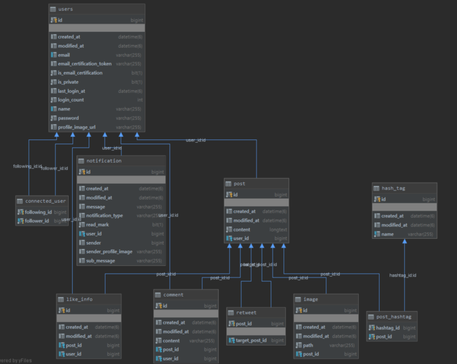

# sns-service

### 간단 소개
트위터 클론 프로젝트

http://ec2-15-165-223-244.ap-northeast-2.compute.amazonaws.com/
(크롬,웨일 접속 가능)

### 사용 스텍
- 백엔드 : Spring Boot, Spring MVC, Spring Security, Spring Data JPA, Spring AOP, JWT, JUnit, Lombok, Swagger, MySql, MariaDB
- 프론트엔드 : React, React-Hooks, Redux, Redux-Saga, Next.js(SSR), Webpack, Axios, Ant design, styled-component, ESLint
- 인프라 : Git, AWS(EC2, RDS, S3, CodeDeploy), Travis CI

### 개발 내용
- 회원가입, 이메일 인증
- 로그인, 인증(JSON WEB TOKEN을 활용한 인증처리)
- 포스트 조회,작성,수정,삭제
- 댓글 조회,작성
- 포스트 좋아요, 좋아요 취소
- 이미지 처리(프로필, 포스트)
- 해시태그
- 포스트 검색
- 리트윗
- 팔로우, 언팔로우
- 인가(비공개 계정인 경우 그 계정의 팔로워들만 포스트를 볼 수 있도록)
- Swagger API 문서화
- 테스트 코드 작성
- 예외처리

### 개발 예정
- 배포
- Notification
- 이벤트

### 서버 API
http://ec2-13-125-116-71.ap-northeast-2.compute.amazonaws.com:8080/swagger-ui.html

### 테이블

### 참고 자료
- 웹 백엔드 시스템 구현 스터디
https://programmers.co.kr/learn/courses/10293

- React로 NodeBird SNS 만들기
https://www.inflearn.com/course/react_nodebird#

- 스프링과 JPA 기반 웹 애플리케이션 개발
https://www.inflearn.com/course/%EC%8A%A4%ED%94%84%EB%A7%81-JPA-%EC%9B%B9%EC%95%B1#curriculum

- 스프링 부트와 AWS로 혼자 구현하는 웹 서비스(도서)

