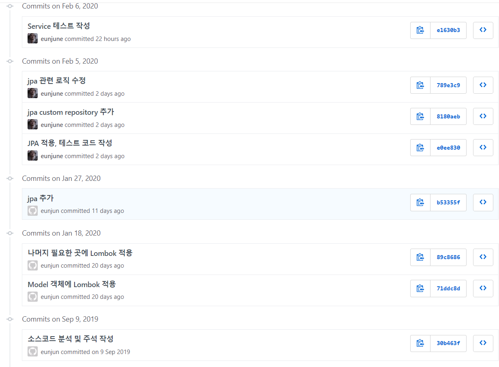

# sns-service

### 간단 소개
트위터 클론 프로젝트

### 사용 스텍
- 백엔드 : Spring Boot, Spring Security, Spring Data JPA, JWT, JUnit, Mockito, Lombok, Swagger, Apache Maven, MySql, Apache Kafka, MSA 
- 프론트 : React, React-Hooks, Redux, Redux-Saga, ESLint, Next.js, Webpack, Axios, SSR
- 기타 : Git, AWS S3

### 개발 내용
- 회원가입, 로그인, 이메일 중복확인
- 이메일 인증
- 포스트 좋아요
- 댓글 작성, 조회
- 이미지 처리
- 해시태그 
- 리트윗
- 팔로우, 언팔로우
- 인가(특정 관계시만 포스트를 볼 수 있도록)
- 인증(JSON WEB TOKEN을 활용한 인증처리)
- 기존의 모놀리틱 구조를 간단한 마이크로 서비스 아키텍처로 확장
- Swagger API 문서화
- JDBC => JPA
- 테스트 코드 작성
- 예외처리
- 서버 사이드 랜더링

### 개발 예정
- 배포
- oAuth
- Notification

### 참고 자료
- 웹 백엔드 시스템 구현 스터디
https://programmers.co.kr/learn/courses/10293

- React로 NodeBird SNS 만들기
https://www.inflearn.com/course/react_nodebird#

- 스프링과 JPA 기반 웹 애플리케이션 개발
https://www.inflearn.com/course/%EC%8A%A4%ED%94%84%EB%A7%81-JPA-%EC%9B%B9%EC%95%B1#curriculum

- 스프링 부트와 AWS로 혼자 구현하는 웹 서비스(도서)

이전 Repository에 문제가 생겨서 다시 만듬. 이전 Repository에서 진행한 commit log

