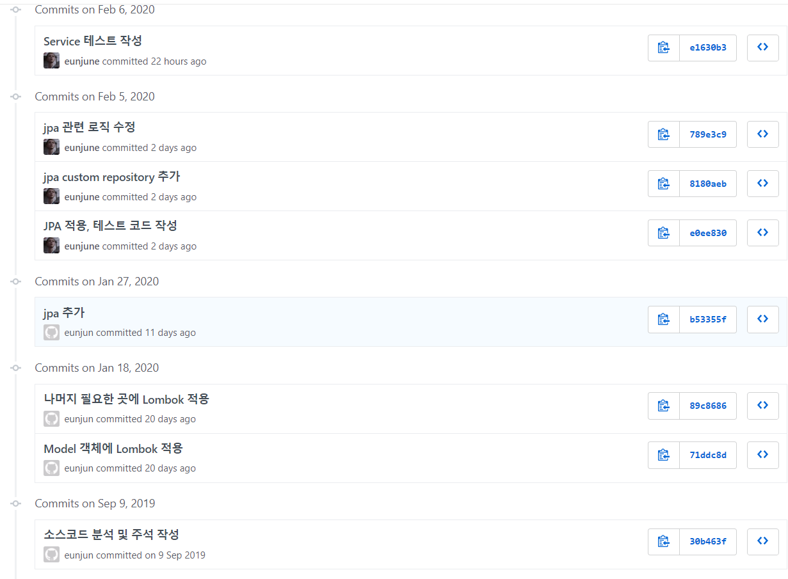

# sns-service

### 간단 소개
페이스북 같은 SNS 기능이 있는 서비스

### 사용 스텍
- 백엔드 : Spring Boot, Spring Security, Spring Data JPA, JWT, Swagger, Apache Maven, MySql, AWS S3, Apache Kafka, MSA 
- 프론트 : React 개발 예정
- 기타 : Git

### 개발 내용
- 회원가입, 로그인, 이메일 중복확인
- 포스트 좋아요
- 포스트 페이징 처리
- 댓글 작성, 조회
- 인가(본인 또는 친구 관계시만 친구의 포스트를 볼 수 있도록)
- 인증(JSON WEB TOKEN을 활용한 인증처리)
- 기존의 모놀리틱 구조를 간단한 마이크로 서비스 아키텍처로 확장
- S3에 이미지 업로드
- Swagger API 문서화
- JDBC => JPA
- 테스트 코드 작성
- 예외처리

### 개발 예정
- 프론트엔드 개발
- 팔로우, 언팔로우
- oAuth

이전 Repository에 문제가 생겨서 다시 만듬. 이전 Repository에서 진행한 commit log

